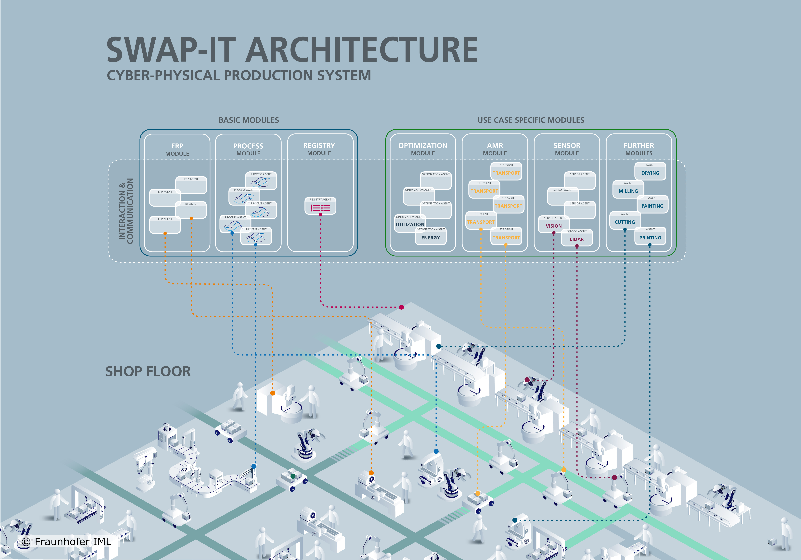
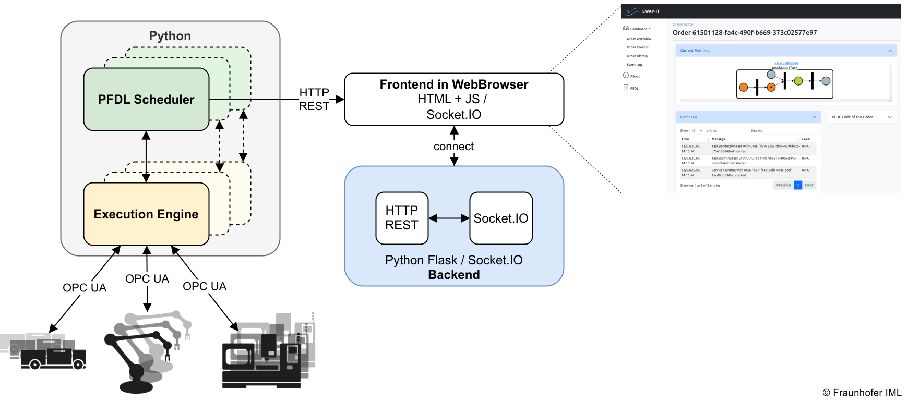

<!--
SPDX-FileCopyrightText: The SWAP-IT Contributors
SPDX-License-Identifier: CC-BY-4.0
-->
# **Architecture**
The goal of »SWAP-IT« and its architecture is to transform a production system into an order-centric production environment.
In order centric production, there exist a variety of distributed agents that interact with each other and act autonomously.
Each production order manages itself and tries to finish itself by interacting with the production environment and other entities inside the CPPS.
Ultimatively, the goal is to create a modular and generic architecture that is not only applicable to CPPS but is extendable to other ecosystems, such as the Fiware Ecosystem. 
As already teased the SWAP-IT architecture consist of so-called basic modules and tech modules.
This page will introdcuce and give detailed information about the base and tech modules and their place in the overall architecture.
The basic modules are the core components of the architecture, enabling interaction with the loosely coupled components that are the tech modules.

 
The overall architecture is based on the [initial work](https://ieeexplore.ieee.org/document/9926665) where the SWAP-IT architecture is introduced.
Each resource on the shop floor is classified as a SWAP-IT asset by creating an asset-specific module type based on the module type defined in the SWAP-IT Common Information Model.
To enable the connection of machines from a variety of different manufactures and to avoid a vendor lock-in, the whole architecture relies on so-called semantic information models which are a simple interchange format that describes which services the machines are offering for example.
Currently, the communication of the modules and the assets is based on OPC UA, however, it is not limited to it, as there are communication interfaces at every component.
As each compony face sdifferent challenges and has a different production enviornment, the implementation of such an integration has to be done case-by-case and can only be supported by the modular structure.
How such an integration is possible and how the SWAP-IT assets are identified and created and how an existing production environment can be realized is explained in the [integration section](how-to-integrate-swap-it.md).

## **Basic Modules**
The »SWAP-IT« basic modules are used through all use cases and are available for every newly created project.
For example, each production order is modled by a single PFDL file which will handle the execution and completion of the order itself.
In the following, each basic module is explained.

### **Production Flow Description Language**
The Production Flow Description Language (PFDL) is a powerful tool used in the realm of manufacturing and production management.
It serves as a standardized language for describing and documenting the various steps and processes involved in manufacturing a product.
A PFDL program corresponds to a single ordered product and specifies the production steps involved.
It also serves as an input for an order controlled production, which can process it automatically.
A PFDL program consists of structs and tasks, allowing for the definition of runtime aspects such as loops, conditions, and synchronization.

PFDL offers a structured and systematic approach to defining the production flow.
It allows manufacturers to break down the entire production process into individual tasks and sequences, providing a clear and comprehensive representation of how the product is made.
Within a PFDL program, manufacturers can define different aspects of the production flow such as task dependencies, parallel execution, loops, conditions, and synchronization. 
This flexibility enables the creation of complex and dynamic production flows that accurately reflect real-world manufacturing scenarios.
Overall, PFDL plays a crucial role in enhancing the understanding, communication, and automation of manufacturing processes, ultimately leading to improved productivity, quality, and efficiency in the production environment.

#### PFDL Scheduler
The PFDL itself is just the description language and needs to be parsed, validated, and transformed into a structure to control the production process.
All of these functionalities is done by the so-called PFDL Scheduler.
The scheduler parses and validates PFDL files, which are then transformed into a domain model, which is a representation of the production order as a python object.
This model can then be used to generate a petri net, which is used to control the production by triggering events and receivve events, e.g. when a service has finished.
To enable this, the PFDL provides interfaces in both directions enabling a process control that makes use of generated PFDLs and keep track of the current state of the execution.

#### **PFDL VS Code Extension**
To support the development of PFDL programs in [Visual Studio Code](https://code.visualstudio.com/), an extension has been developed that provides features such as syntax and error highlighting, code completion, and visualization of the PFDL code as a Petri net.
These features increase integration speed and enable a deeper understanding of the implemented process flow by observing the generated petri net.
  

 

The extension generates a graphical representation of the PFDL program and provides a dynamic webview for development purposes. The visualization can be displayed alongside the PFDL program and is updated reactively. You can choose the orientation of the graph, either horizontal or vertical, for convenience. The nodes in the graph can be moved, but overlapping is not allowed. Labels for individual nodes are hidden by default and only shown when the mouse is over them. Box labels can also be hidden. As the PFDL program becomes more complex, collapsing large components into a single one can be helpful. Within the webview, you can select specific components to collapse or collapse all at once. Expanding nodes is done accordingly. When a PFDL program is open in the active text editor in VS Code, two buttons appear in the top right corner. "Visualize Code" displays the graph visualization of the PFDL program, and "Download PNG" saves the graph as a .png file. The graph is always updated when the PFDL program is saved. Error messages are displayed if there are any errors in the file.

### **»SWAP-IT« Dashboard**
The »SWAP-IT« Dashboard is a technical tool used to visualize and manage an order controlled production system.
It allows users to view the latest orders in an order overview window, access detailed information about a specific order, including its logs, PFDL description, and Petri net.

    

The dashboard also maintains a history of finished orders for future use and processing.
The tool is implemented as a Flask webserver and can be easily started as an Python3 application.
It is possible to connect the Scheduler with a Dashboard. This will add the corresponding Production Order to the Dashboard when the Scheduler is started. Now, all updates of the order are visualized in real time.
To enable this functionality, an address to the dashboard can be passed to the Scheduler class. If such an address is given, the Scheduler will send log messages (e.g. Task started, Service finished, ...), Petri Net updates, and order updates to the corresponding address. You can, however, also send messages to the dashboard from outside of the scheduler.

### **Execution Engine**
The Execution Engine (EE) acts as a link between the PFDL Scheduler and Field Level Devices. Our implementation uses the EE as an OPC UA Server, but it can be adapted to different approaches.
The EE is launched at the start of petri net execution and works with the Scheduler to execute scheduled services on the field level.  It shuts down once the petri net reaches its final state. The Execution Engine (EE) provides several functions, such as an interface for the PFDL Scheduler and field-level resources. It also includes a Data Lifecycle Object responsible for managing data during Petri net execution. This object supplements the variables defined in the PFDL with runtime data obtained from the Field Level, enabling the PFDL Scheduler to access this data. The EE can also assign services to resources when multiple resources offer identical services.

The Execution Engine-PFDL Scheduler interface uses callback functions from the PFDL Scheduler to receive information about scheduled tasks and services. This enables the Execution Engine to initiate transitions of the Petri Net by placing tokens. The interface also allows the Scheduler to access runtime data stored in the Execution Engine.
The Execution Engine - Device Interface enables communication between the Execution Engine and Field Level Devices, allowing for the execution of services scheduled by the PFDL Scheduler. This communication is protocol-agnostic and can support various protocols. In our OPC UA Server implementation, OPC UA Clients are used to communicate with Field Level Devices. However, alternative protocols such as MQTT can also be implemented.

### **Device Registry**
The Registry Module is a platform for resource servers, which represent field-level devices, to register themselves and become available for executing PFDL Services.
The Device Registry also includes a built-in functionality for filtering resources based on their capabilities.
For example, this filtering can be used to assign a transport task to an autonomous guided vehicle (AGV) with a maximum payload capacity.
The Execution Engine can now use the Device Registry's Filter Agent Method to obtain a list of AGVs that can carry a specific product.
Factors such as the product's weight and the maximum payload capacity of the resources are also considered by the device registry to filter and identify suitable resources .

### **Order Module**
The Order Registry module operates similarly to an Enterprise Resource Planning (ERP) system. It enables the initiation of new production processes by generating process agents.
When an order is received in the ERP system, the corresponding PFDL file that describes the product is selected.
These PFDL files contain placeholders where specific parameters for the final product, such as color or specific parts, can be inserted.
Subsequently, a process agent is created using the parameterized PFDL as input.

## **Tech Modules**
These modules are use case specific and will be accessible in a later development stage.
