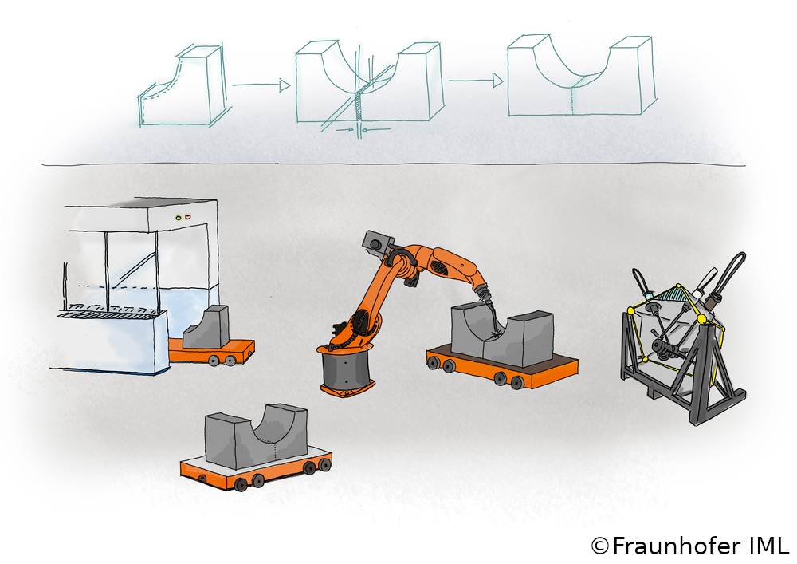
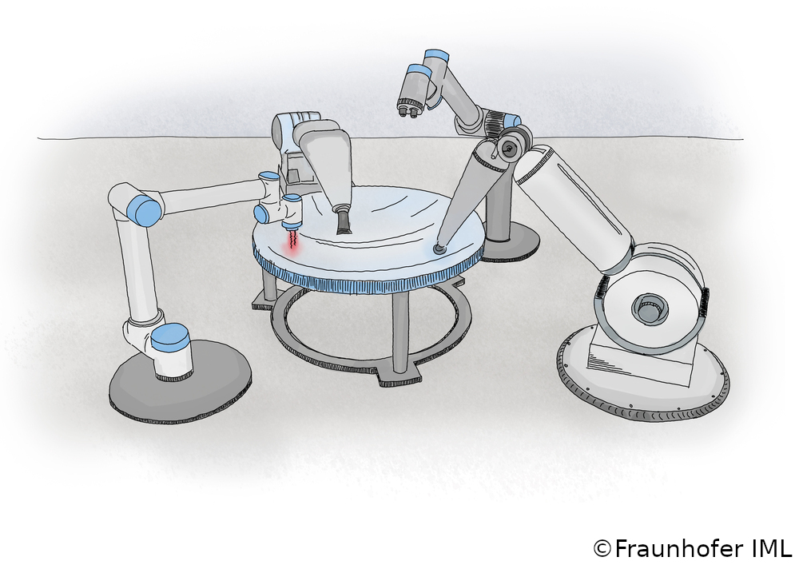
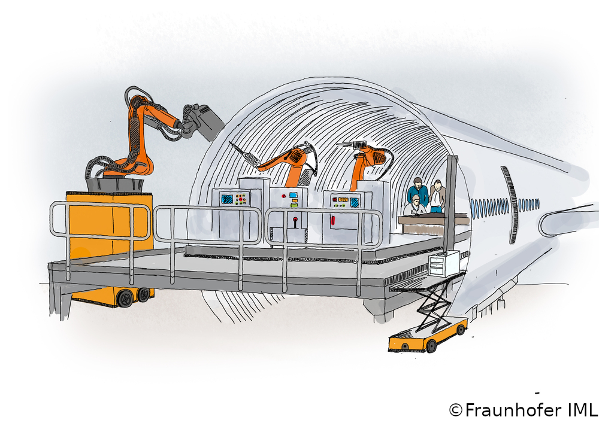
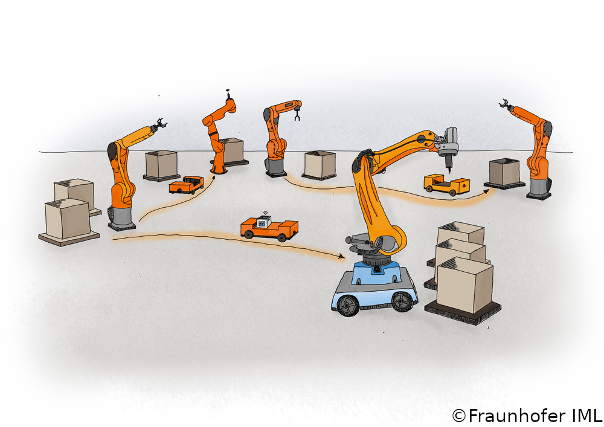

<!--
SPDX-FileCopyrightText: The SWAP-IT Contributors
SPDX-License-Identifier: CC-BY-4.0
-->
# **Success Stories**
Part of this documentation is a collection of four industry-relevant success stories which can be executed to show the capabilities of »SWAP-IT«.
This also includes the features and their cooperation among each other in a more complex context than then the demonstration sample.

## **Large component production through segmentation**

Large components that consist of multiple building blocks are hard to construct and are often needed in the automotive industry or exemplarly in wind turbines.
In these domains, specialized single-purpose large machine tools are typically used to manufacture large components like engines or forming tools.
To improve the production efficiency, a swarm approach can be used to break up the existing process chain and allow for parallel manufacturing of large components in segments.
A CPPS may utilize various entities, including robots, mobile machines, or single-purpose large machine tools.
The CAD model of the component is then used to divide the segments for parallel production.
Once completed, the individual segments are coming together and are welded to form a complete component.
To ensure a proper quality of the final product the final step includes surface and finish processing.

For more information, visited the use case website [here](https://www.produktion.fraunhofer.de/de/forschung-im-verbund/formate/leitprojekte/swap/grossbauteilfertigung.html)

## **Precision component production**

The aviation and aerospace industries, as well as basic research and precision machine elements, have an increasing demand for precision components. To meet these demands, new manufacturing approaches are necessary to enable economical production while meeting increasing requirements of all kinds.
Large optics are a core product of this application.
Exemplarly, they are necessary for basic research and astronomy applications. 
These large optics are increasingly large, high-value surfaces used in telescopes or precision applications.
The complexity of these surfaces increases the time and cost required to manufacture using traditional methods.
To facilitate parallel machining, the surface is divided into sub-segments and each segment is machined in parallel.
Each segment can now be processed by a machine or robot which is assigned to tasks such as measuring or grinding.

Fraunhofer has succeeded in developing a new, efficient and scalable method, while maintaining the highest quality features and low costs. Utilization-optimized production makes it possible for the first time to decouple the scaling of the number of workpieces, size and accuracy from the individual performance of the processing machines.
Different resources, machining processes, functionalization and characterization as well as measuring and handling processes are combined and linked by in-situ process analysis of several cooperating robot stations.

For more information, visited the use case website [here](https://www.produktion.fraunhofer.de/de/forschung-im-verbund/formate/leitprojekte/swap/praezisionsbauteilfertigung.html)

## **Assembly automation in aircraft construction**

Due to the size of the components and the infrastructure required, aircraft construction is mainly manual. However, this limits production numbers and with the increasing demand for smaller aircraft for short and medium-haul flights, production capacities need to be increased. Additionally, the automation of production and assembly is becoming increasingly important in aircraft construction. To achieve this goal, new methods must be developed to enable machines to guide and organize components with minimal human intervention. This can be achieved through the use of sensor-guided and swarm-based production techniques. The project is currently being tested on an aircraft fuselage component, where tasks such as rivet drilling require high precision and accurate measurement using sensors and measuring devices. The robots will work alongside humans and other robots to complete tasks autonomously.

Today, the production of small series can be significantly supported by location-flexible robot systems. They process components using laser processes and rivet essential areas of the fuselage shells together. Mobile measuring robots ensure quality, i.e. they automatically measure the location-flexible processing robots and check the processing results. This is made possible by robot autonomy and robot-robot cooperation. Robot actions are generated automatically. No personal information is required. In addition, different processes can be flexibly implemented.

For more information, visited the use case website [here](https://www.produktion.fraunhofer.de/de/forschung-im-verbund/formate/leitprojekte/swap/montage-im-flugzeugbau.html)

## **Components to distributed workstations**

In this use case, the main issue at hand is the creation of customized products for smaller target audiences.
This includes medical devices (especially implants), wearables, and high-end mass-produced items (such as automobiles).
These products are considered part of a collective group that can be moved to various processing stations.
The initial test will focus on a basic concept: robots must be able to identify and grasp the products and materials, check them, and then transport and deposit them.

Order-specific material flow can be achieved by flexibly linking workstations using freely navigating driverless transport vehicles. AI-based optimization algorithms allow the workload to be optimally distributed among the production resources to achieve short throughput times. As a result, highly flexible production systems can be implemented that produce customized products of the highest quality in a cost-effective and sustainable manner.

For more information, visited the use case website [here](https://www.produktion.fraunhofer.de/de/forschung-im-verbund/formate/leitprojekte/swap/bauteile-zu-verteilten-arbeitsstationen.html)